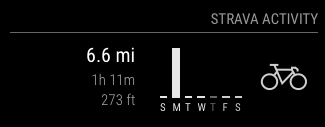

# MagicMirror Module: MMM-Strava

A MagicMirror Module for displaying your Strava data.

[](https://raw.githubusercontent.com/ianperrin/MMM-Strava/master/LICENSE)
[](https://travis-ci.org/ianperrin/MMM-Strava)
[](https://codeclimate.com/github/ianperrin/MMM-Strava)
[](https://snyk.io/test/github/ianperrin/MMM-Strava)

## Example

 

### The module displays activity information in one of two modes

* `table` mode, which includes
  * The number of activities for the period.
  * The total distance for the period.
  * The total elevation gain for the period. (optional)
  * The total moving time for the period. (optional)
  * The total elapsed time for the period. (optional)
  * The total number of achievements (recent period only).
* `chart` mode, which includes
  * The total distance, moving time and elevation for the last week.
  * A chart showing the total distance by day (for `recent` period) or month (for `ytd` period).

### In addition you can configure the following options

* Which `activities` (and the order activities) should be displayed.
* Which `stats` should be displayed in `table` mode.
* Which `period` to display stats for your activities: Recent (last 4 weeks in `table` mode or current week in `chart` mode), year to date or all time (only applicable in `table` mode).
* Whether the module should rotate through the different periods, and the interval between rotations. (only applicable in `table` mode)
* The units (miles/feet or kilometres/metres) used to display the total distance and elevation gain for each activity.
* The locale used for determining the date (day or month) labels in the chart.

## Installation

Clone this repository into your MagicMirror's Module folder:

````bash
cd ~/MagicMirror/modules
git clone https://github.com/ianperrin/MMM-Strava.git
npm install --production
````

[Configure the module](#configuring-the-module) in your `config/config.js` file.

[Authenticate the module](#authenticating-the-module) to allow access to the Strava API.

## Updating the module

To update the module to the latest version, pull the changes from this repository into the MMM-Strava folder:

````bash
cd ~/MagicMirror/modules/MMM-Strava
git pull
npm install --production
````

If you haven't changed the module, this should work without any problems.
Type `git status` to see your changes, if there are any, you can reset them with `git reset --hard`. After that, `git pull` should be possible.

## Configuring the module

To use this module, add it to the modules array in the `config/config.js` file:

````javascript
modules: [
    {
        module: "MMM-Strava",
        position: "top_right",
        config: {
            client_id: "your_strava_application_id",
            client_secret: "your_strava_api_access_token"
        }
    }
]
````

### Configuration options

The following properties can be added to the configuration:

| **Option** | **Default** | **Description** | **Possible Values** |
| --- | --- | --- | --- |
| `client_id` |  | *Required* - The Client ID for your Strava API Application, obtained from [your My API Application page](https://www.strava.com/settings/api). |  |
| `client_secret` |  | *Required* - The Client Secret for your Strava API Application, obtained from [your My API Application page](https://www.strava.com/settings/api). |  |
| `mode` | `table` | *Optional* - Determines which mode should be used to display activity information. | `"table"`, `"chart"` |
| `activities` | `["ride", "run", "swim"]` | *Optional* - Determines which activities to display and in which order they are displayed. *Note:* - The activities can be listed in any order, and only one is required. However, they must be entered as an array of strings i.e. comma separated values within square brackets. | `"ride"`, `"run"`, `"swim"` |
| `period` | `recent` | *Optional* - What period should be used to summarise the activities in `table` mode. | `recent` = recent (last 4 weeks), `ytd` = year to date, `all` = all time |
| `stats` | `["count", "distance", "achievements"]` | *Optional* - Determines which statistics to display in `table` mode. *Note:* - The stats can be listed in any order, and only one is required. However, they must be entered as an array of strings i.e. comma separated values within square brackets. | `"count"`, `"distance"`, `"elevation"`, `"moving_time"`, `"elapsed_time"`, `"acheivements"` |
| `auto_rotate` | `false` | *Optional* - Whether the summary of activities should rotate through the different periods in `table` mode. | `true` = rotates the summary through the different periods, `false` = displays the specified period only. |
| `units` | `config.units` | *Optional* - What units to use. Specified by config.js | *Possible values:* `config.units` = Specified by config.js, `metric` = Kilometres/Metres, `imperial` = Miles/Feet |
| `fade` | `false` | *Optional* - Whether to fade the activities to black. (Gradient) | *Possible values:* `true` or `false` |
| `updateInterval` | `10000` (10 seconds) | *Optional* - How often does the period have to change? (Milliseconds). | *Possible values:* `1000` - `86400000` |
| `reloadInterval` | `300000` (5 minutes) | *Optional* - How often does the data needs to be reloaded from the API? (Milliseconds). See [Strava documentation](http://strava.github.io/api/#rate-limiting) for API rate limits | `7500` - `86400000` |
| `animationSpeed` | `2500` | *Optional* - The speed of the update animation. (Milliseconds) | `0` - `5000` |
| `locale` | `config.language` | *Optional* - The locale to be used for displaying dates - e.g. the days of the week or months or the year in chart mode. If omitted, the config.language will be used. | e.g. `en`, `en-gb`, `fr` etc |
| `debug` | `false` | *Optional* - Outputs extended logging to the console/log | `true` = enables extended logging, `false` = disables extended logging |

## Authenticating the module

The `client_id` and `client_secret` can be obtained from [your My API Application page](https://www.strava.com/settings/api). Once you have added these to the `config.js` and started your Magic Mirror, follow the steps below to authenticate the application with Strava:

1. Browse to the Strava authentication page: [http://localhost:8080/MMM-Strava/auth/](http://localhost:8080/MMM-Strava/auth/) - _the exact URL may vary depending on your configuration._
2. Select the module you wish to authenticate (e.g. `module_4_MMM-Strava`) and click/tap *Authorise* -_The number of the module will vary depending on your configuration._
3. On the Strava Authorisation page, select the level of access you wish to give to the Magic Mirror, and click/tap *Authorize* - _the module requires at least `View data about your public profile` and `View data about your activities` but it's up to you whether you want to allow access to `private activities`._
4. Once the successful authorisation message appears, restart your Magic Mirror.
