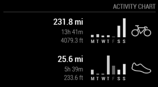

# MagicMirror Module: MMM-Strava
A MagicMirror Module for displaying your Strava data.

[](https://travis-ci.org/ianperrin/MMM-Strava)
[](https://raw.githubusercontent.com/ianperrin/MMM-Strava/master/LICENSE)

## Example

 

### The module displays activity information in one of two modes:
* `table` mode, which includes
  * The number of activities for the period.
  * The total distance for the period.
  * The total number of achievements (recent period only).
* `chart` mode, which includes
  * The total distance, moving time and elevation for the last week.
  * A chart of distance by day.

### In addition you can configure the following options
* Which `activities` (and the order activities) should be displayed.
* Which `period` to display stats for your activities: Recent (last 4 weeks), year to date or all time. (only applicable in `table` mode)
* Whether the module should rotate through the different periods, and the interval between rotations. (only applicable in `table` mode)
* The units (miles/feet or kilometres/metres) used to display the total distance for each activity.

## Installation

In your terminal, go to your MagicMirror's Module folder:
````
cd ~/MagicMirror/modules
````

Clone this repository:
````
git clone https://github.com/ianperrin/MMM-Strava.git
````

Configure the module in your `config/config.js` file.

## Updating the module

If you want to update your MMM-Strava module to the latest version, use your terminal to go to your MMM-Strava module folder and type the following command:

````
git pull
```` 

If you haven't changed the modules, this should work without any problems. 
Type `git status` to see your changes, if there are any, you can reset them with `git reset --hard`. After that, git pull should be possible.

## Using the module

To use this module, add it to the modules array in the `config/config.js` file:
````javascript
modules: [
    {
        module: 'MMM-Strava',
        position: 'top_right',
        config: {
            strava_id: 'your_strava_id',
            access_token: 'your_strava_api_access_token'
        }
    }
]
````

## Configuration options

The following properties can be configured:

| **Option** | **Default** | **Description** | **Possible Values** |
| --- | --- | --- | --- |
| `strava_id` |  | *Required* - Your Strava ID. Obtained from [your My Profile page](https://support.strava.com/hc/en-us/articles/216928797-Where-do-i-find-my-Strava-ID-). For more than 1 user you can use `[strava_id_1, strava_id2]` |  |
| `access_token` |  | *Required* - Your Strava API Access Token. Obtained from [your My API Application page](https://www.strava.com/settings/api). For more than 1 user you can use `[access_token_user_1, access_token_user_2]` |  |
| `mode` | `table` | *Optional* - Determines which mode should be used to display activity information. | `"table"`, `"chart"` |
| `activities` | `["ride", "run", "swim"]` | *Optional* - Determines which activities to display and in which order they are displayed. *Note:* - The activities can be listed in any order, and only one is required. However, they must be entered as an array of strings i.e. comma separated values within square brackets. | `"ride"`, `"run"`, `"swim"` |
| `athlete_text` |  | *Optional* - Replaces the activity texts `"ride"`, `"run"`, `"swim"` with the athlete name you define here. Makes sense if the module is set up for more than 1 user. | `[athlete_1, athlete_2]` |
| `period` | `recent` | *Optional* - What period should be used to summarise the activities in `table` mode. | `recent` = recent (last 4 weeks), `ytd` = year to date, `all` = all time |
| `elevation` | `false` | *Optional* - If set elevation is displayed in `table` mode. | `true` = displays the elevation data, `false` = hides the elevation data. |
| `auto_rotate` | `false` | *Optional* - Whether the summary of activities should rotate through the different periods in `table` mode. | `true` = rotates the summary through the different periods, `false` = displays the specified period only. |
| `units` | `config.units` | *Optional* - What units to use. Specified by config.js | *Possible values:* `config.units` = Specified by config.js, `metric` = Kilometres/Metres, `imperial` = Miles/Feet |
| `fade` | `false` | *Optional* - Whether to fade the activities to black. (Gradient) | *Possible values:* `true` or `false` |
| `fadePoint` | `0.1` | *Optional* - Where to start fade? | *Possible values:* `0` (top of the list) - `1` (bottom of list) |
| `updateInterval` | `10000` (10 seconds) | *Optional* - How often does the period have to change? (Milliseconds). | *Possible values:* `1000` - `86400000` |
| `reloadInterval` | `300000` (5 minutes) | *Optional* - How often does the data needs to be reloaded from the API? (Milliseconds). See [Strava documentation](http://strava.github.io/api/#rate-limiting) for API rate limits | `7500` - `86400000` |
| `animationSpeed` | `2500` | *Optional* - The speed of the update animation. (Milliseconds) | `0` - `5000` |
